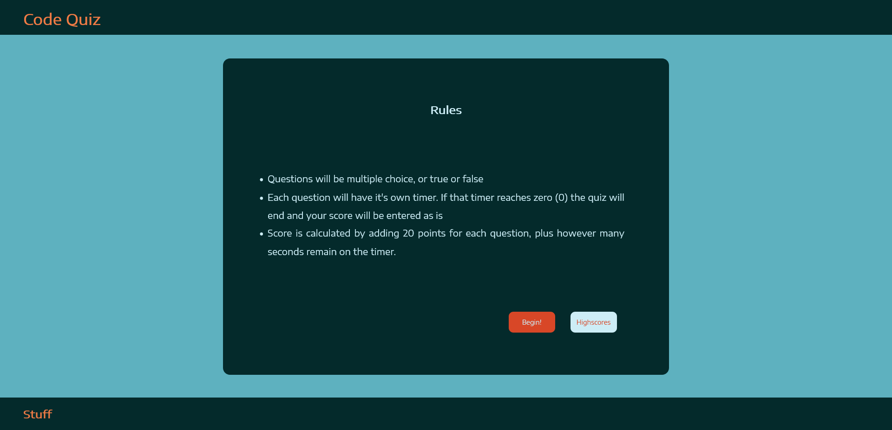
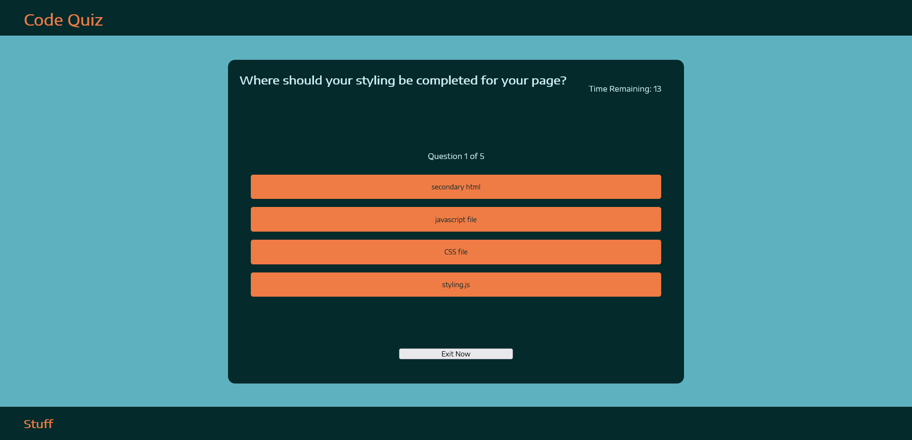
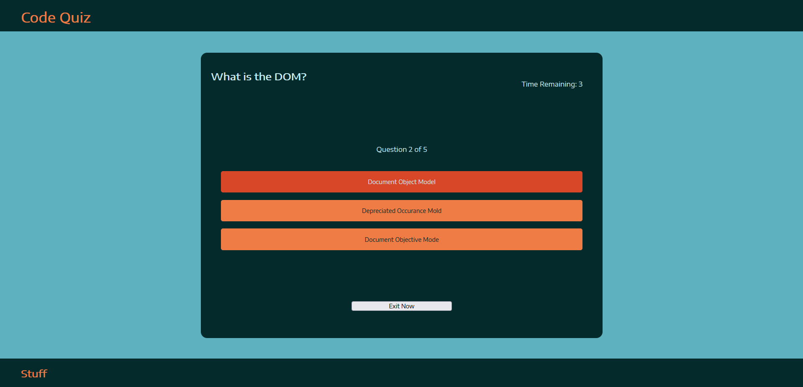
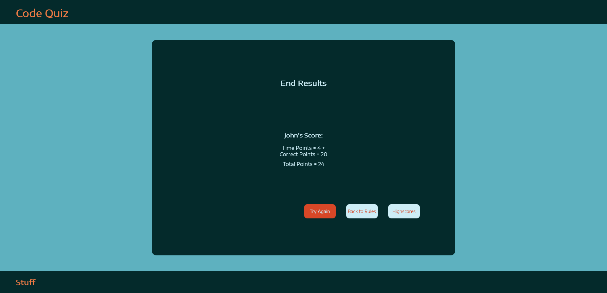
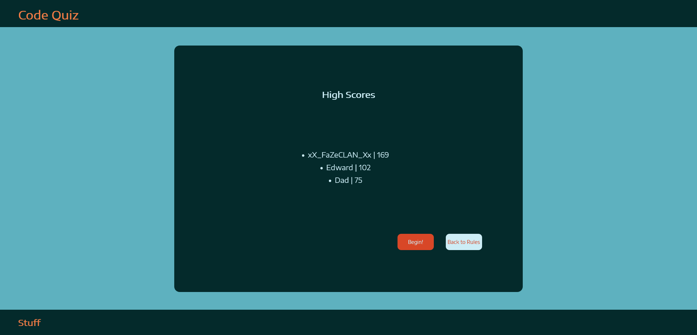
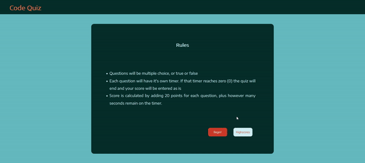

# Code Quiz

## What is it?

This is a simple quiz made with HTML, CSS, and Javascript. It cylcles through 
questions at random, randomizes the answers for those questions, and keeps track
of the user's score as they complete the quiz. The quiz also has a highscore board 
for keeping track of who has completed the quiz, and keeps them sorted in order of 
score to show who has done the best.

## Purpose

Allows the user to test their knowledge and compare that to others.

## Sneek Peek

Here are a few images from the working product

>Rules
>

>Questions
> 

>End Screen
>

>Highscores
>

## Finished Product

Link to live [Code Quiz](https://vidalatan.github.io/code_quiz)

Link to [Repository](https://github.com/Vidalatan/code_quiz)